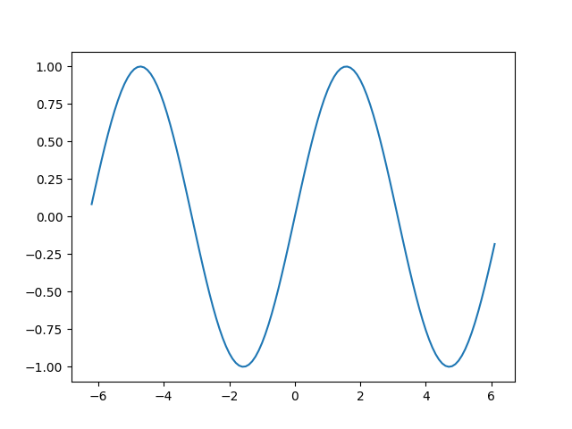

=====================
 빌더 패턴
=====================

*:doc:`/gang-of-four/index`의 "생성 패턴"*

.. admonition:: 결론

   갱 오브 포가 구상한 완전한 빌더 패턴은
   단일 메서드 호출 시리즈를 통해
   여러 다른 객체 계층을 생성하도록 배열되었지만 —
   이 패턴의 사용은 파이썬에서 극히 드문 것으로 나타났습니다.
   대신 빌더는 단순히 편의성 때문에 널리 사용됩니다.

   프로그램의 각 불변 클래스를
   더 편리한 빌더 클래스와 쌍을 이루는
   "빌더"라고 부르는 최신 패턴을 보았을 수도 있습니다.
   다행히도 이 패턴은 파이썬에서 전혀 필요하지 않습니다.
   언어 자체가 선택적 생성자 인수에 대한
   기본 제공 구문 지원을 제공하기 때문입니다.

.. contents:: 목차:
   :backlinks: none

.. TODO Facade 패턴이 작성되면 링크 추가

빌더 패턴은 매우 흥미로운 역사를 가지고 있습니다.
갱 오브 포가 패턴에 대한 장의 첫 문장에서 설명했듯이,
주요 의도는 패턴이 사용되는 가장 드문 목적이 되었습니다.
대신 빌더는 갱 오브 포가 부차적인 이점으로 간주했던
편의성 때문에 거의 모든 곳에서 사용됩니다.

최근에는 생성자 호출에서 선택적 매개변수가 부족한
덜 표현적인 특정 프로그래밍 언어에서 나타나는
"빌더"라는 이름을 채택한 훨씬 간단한 패턴이 있습니다.

이 글에서는 파이썬 프로그램에서 빌더 패턴의 가장 인기 있는 사용법을 설명하는 것으로 시작합니다.
다음으로 갱 오브 포가 패턴의 주요 목적이라고 생각했던 것을 살펴보고,
파이썬에서 거의 그런 방식으로 사용되지 않는 이유를 탐색합니다.
마지막으로 완전성을 기하기 위해,
파이썬보다 덜 유연한 구문을 가진 언어를 돕기 위해
패턴을 최근에 사용하는 방법을 살펴보겠습니다.

편의로서의 빌더
==========================

빌더 패턴은 파이썬에서 매우 인기가 있습니다.
정교한 객체 계층 생성을 지시하면서도
클라이언트 코드를 단순하고 세련되게 유지할 수 있기 때문입니다.

공식적인 정의는 라이브러리가
간단한 함수 및 메서드 호출 시리즈를 만들 수 있도록 할 때마다
빌더 패턴이 존재한다는 것입니다.
이면에서 라이브러리는 전체 객체 계층을 빌드하여 반응합니다.
빌더 패턴 덕분에 호출자는
각 객체를 수동으로 인스턴스화하거나
생성된 객체가 어떻게 맞춰지는지 이해할 필요가 없습니다.

파이썬의 고전적인 예는
`matplotlib <https://matplotlib.org/>`_ 라이브러리의
``pyplot`` 인터페이스입니다.
호출자가 단 한 줄의 코드로 간단한 플롯을 빌드하고,
단 한 줄만 더 추가하여 다이어그램을 디스크에 저장할 수 있도록 합니다.

.. testsetup::

   import os
   os.chdir('gang-of-four/builder')

.. testcleanup::

   os.chdir('../..')

.. testcode::

   import numpy as np
   x = np.arange(-6.2, 6.2, 0.1)

   import matplotlib.pyplot as plt
   plt.plot(x, np.sin(x))
   plt.savefig('sine.png')

pyplot 인터페이스가 호출자에게 숨긴 것은
matplotlib이 이 간단한 플롯조차도 나타내기 위해
12개 이상의 객체를 만들어야 했다는 것입니다.
예를 들어, 다음은 위 ``plot()`` 호출에 의해
이면에서 생성된 8개의 객체입니다.

>>> plt.gcf()
<Figure size 640x480 with 1 Axes>

>>> plt.gcf().subplots()
<matplotlib.axes._subplots.AxesSubplot object at 0x7ff910917a20>

>>> plt.gcf().subplots().bbox
TransformedBbox(
    Bbox(x0=0.125, y0=0.10999999999999999, x1=0.9, y1=0.88),
    BboxTransformTo(
        TransformedBbox(
            Bbox(x0=0.0, y0=0.0, x1=6.4, y1=4.8),
            Affine2D(
                [[100.   0.   0.]
                 [  0. 100.   0.]
                 [  0.   0.   1.]]))))

matplotlib은 더 많은 키워드 인수를 제공하거나
플롯을 사용자 정의하기 위해 추가 호출을 할 수 있도록 하지만,
``pyplot``은 플롯이 객체로 표현되는 방식의
모든 세부 정보로부터 우리를 기꺼이 격리합니다.

빌더 패턴은 이제 파이썬 문화에 깊이 뿌리내렸습니다.
부분적으로는 라이브러리 작성자가 첫 페이지의 샘플 코드를
가능한 한 인상적으로 간결하게 만들어야 한다는 압박감 때문입니다.
그러나 이러한 압박감에도 불구하고,
여전히 라이브러리를 사용하는 과정에서
호출자가 직접 전체 객체 계층을 빌드할 것으로 예상하는
라이브러리가 존재합니다.

일부 라이브러리가 호출자에게 지루하게 객체를 인스턴스화하도록
의존한다는 사실은 경쟁업체에서 광고로 사용되기도 합니다.
예를 들어,
`Requests 라이브러리 <http://docs.python-requests.org/en/master/>`_는
인증을 사용한 HTTP 요청에 대한 한 줄짜리 코드를
이전 `urllib2 <https://docs.python.org/2/library/urllib2.html>`_
표준 라이브러리 모듈로 수행한 동일한 기동과 비교하여
사용자에게 유명하게 소개합니다.
공정하게 말하면, 흥미로운 작업을 수행하려면
호출자가 작은 객체 더미를 빌드해야 합니다.
``urllib2`` 설명서의 "예제" 섹션은
다음과 같은 그림을 제공합니다.

    import urllib2

    # 기본 HTTP 인증을 지원하는 OpenerDirector 만들기...

    auth_handler = urllib2.HTTPBasicAuthHandler()
    auth_handler.add_password(realm='PDQ Application',
                              uri='https://mahler:8092/site-updates.py',
                              user='klem',
                              passwd='kadidd!ehopper')
    opener = urllib2.build_opener(auth_handler)

    # ...그리고 urlopen과 함께 사용할 수 있도록 전역적으로 설치합니다.

    urllib2.install_opener(opener)
    urllib2.urlopen('http://www.example.com/login.html')

여기서 빌더 패턴이 사용되었다면,
라이브러리는 대신 클라이언트 코드에서
오프너 - 빌더 - 인증 핸들러 계층의
구조와 클래스를 숨기는 함수나 메서드를 제공했을 것입니다.

뉘앙스
======

matplotlib ``pyplot`` 인터페이스가 빌더라고 주장하는 것은
갱 오브 포의 빌더에 대한 장의 끝에서 두 번째 단락에 의해 복잡해집니다.

    "빌더는 **최종 단계로 제품을 반환하지만**, 추상 팩토리 패턴에 관한 한 제품은 즉시 반환됩니다."

이 규정은 빌더와 :doc:`추상 팩토리 </gang-of-four/abstract-factory/index>` 간의 차이점에 초점을 맞추지만,
갱 오브 포에게는 두 패턴 모두 생성된 객체를 호출자에게 반환하는 것으로
결론을 내려야 한다는 것을 분명히 합니다.
빌드된 객체를 반환하는 중요한 최종 단계가 없다면,
빌더는 대신 Facade 패턴으로 격하될 수 있습니다.

따라서 엄격한 정의에 따르면,
위의 예제 코드에서 ``pyplot``은 빌더로 인정되지 않을 수 있습니다.
내 ``plot()`` 호출이 생성한 객체에 대한 실제 참조를
요청하지 않기 때문입니다.
누군가가 이 점을 지적할 경우 내 예제를 구출하기 위해,
플롯에 대한 참조를 요청하고
플롯 자체에 렌더링된 이미지를 파일에 저장하도록 요청할 수 있습니다.

::

   plt.plot(x, np.sin(x))
   sine_figure = plt.gcf()  # "gcf" = "get current figure"
   sine_figure.savefig('sine.png')

이것이 현학의 요구 사항입니다. 추가 코드 한 줄입니다.

결투 빌더
================

갱 오브 포가 빌더를 소개했을 때,
그들은 단순한 편의성과 캡슐화보다
패턴에 대한 더 큰 야망을 가지고 있었습니다.
빌더에 대한 장의 첫 문장은
다음과 같은 "의도"를 선언했습니다.

    "복잡한 객체의 구성을 해당 표현과 분리하여
    동일한 구성 프로세스가 다른 표현을 생성할 수 있도록 합니다."

따라서 갱 오브 포에게는,
라이브러리가 동일한 빌더의 여러 구현을 제공할 때만
빌더 패턴이 최대한으로 작동합니다.
각 구현은 동일한 클라이언트 호출 시리즈에 응답하여
다른 객체 계층을 반환합니다.

오늘날 가장 인기 있는 파이썬 라이브러리에서
완전한 빌더 패턴이 자주 사용된다는 증거를 찾을 수 없습니다.

왜 패턴이 널리 사용되지 않았을까요?

답은 파이썬 프로그램 실행의 한 단계에서 다음 단계로
일반적으로 전달되는 공통 통화로서의
데이터와 데이터 구조의 우위라고 생각합니다.
이유를 이해하기 위해,
갱 오브 포의 자체 샘플 코드로 돌아가 봅시다.
예를 들어, 다음은 미로 생성에 대한 호출에 응답할 때
빌더가 배치되는 한 가지 상황입니다.
(예제는 파이썬으로 번역하기 위해 약간 편집되었습니다.)

.. testcode::

    class StandardMazeBuilder(object):
        # ...
        def build_door(self, n1, n2):
            room1 = self._current_maze.get_room(n1)
            room2 = self._current_maze.get_room(n2)
            door = Door(r1, r2)

            room1.set_side(common_wall(r1, r2), d)
            room2.set_side(common_wall(r2, r1), d);

코드가 강요되는 어색한 응답 패턴에 유의하십시오.
미로가 구성 중이라는 것을 알고 있지만,
``self``에게 ``current_maze`` 속성을 요청하여
미로에 대한 참조를 복구해야 합니다.
그런 다음 새 정보로 방 객체를 업데이트하기 위해
몇 가지 조정을 해야 하므로
후속 상호 작용이 새 상태에서 시작됩니다.
이것은 콜백 시리즈로 왜곡된 I/O 코드처럼 의심스럽게 보입니다.
각 콜백은 상태 기계를 한 번 더 클릭하여 앞으로 나아가기 위해
현재 세계 상태를 다시 가져오고 다시 조립해야 합니다.

최신 파이썬 라이브러리가
동일한 클라이언트 생성자 호출 시리즈에서
두 가지 매우 다른 종류의 활동을 추진하려는 경우,
해당 라이브러리가 동일한 빌더 인터페이스의
두 가지 완전히 별개의 구현을 제공하는 것은 매우 드뭅니다.
두 빌더 모두 동일한 점진적인
클라이언트 중심 업데이트 시리즈를 통해
일관된 결과를 생성할 수 있어야 합니다.

대신, 최신 파이썬 라이브러리는 압도적으로
주어진 빌더의 단일 구현을 가질 가능성이 높습니다.
호출자의 함수 및 메서드 호출에서
단일하고 잘 정의된 중간 표현을 생성하는 구현입니다.
공개적으로 문서화되었든 라이브러리에 비공개 및 내부적이든,
해당 표현은 다운스트림 변환 또는 출력 루틴의
입력으로 제공될 수 있습니다.
이제 중간 데이터 구조를 가로질러
자신의 속도와 원하는 순서대로 자유롭게 이동할 수 있으므로
처리가 더 간단해집니다.

콜백 프로그래밍의 인기와
중간 표현을 전면에 내세우는 것의 인기를 비교하려면,
|sax|_를 사용하는 파이썬 라이브러리의 빈약한 수와 —
긴 ``startElement()`` 및 ``endElement()`` 호출 시리즈에 응답하여
문서에 대해 학습합니다 —
`ElementTree <https://docs.python.org/3/library/xml.etree.elementtree.html>`_ API의
광범위한 인기를 비교하십시오.
이 API는 XML이 이미 완전히 구문 분석되었다고 가정하고
호출자에게 원하는 순서대로 트래버스할 수 있는
문서 객체 모듈을 제공합니다.

.. |sax| replace:: 표준 라이브러리 ``lmx.sax`` 패키지
.. _sax: https://docs.python.org/3/library/xml.sax.html

따라서 깊은 복합 정보를 나타내는
튜플, 리스트, 딕셔너리, 클래스와 같은
파이썬의 매우 풍부한 데이터 타입 모음과
이를 트래버스하는 코드를 작성하는 편의성 때문에
오늘날 인기 있는 파이썬 라이브러리에서
완전한 빌더 패턴이 거의 완전히 사라졌을 것입니다.

퇴화된 경우: 선택적 인수 시뮬레이션
================================================

완전성을 기하기 위해,
갱 오브 포가 설명한 패턴과 다른
대안적인 빌더 패턴을 설명해야 합니다.
블로그 게시물이나 책에서 보았고
차이점에 혼란스러워했을 경우를 대비해서입니다.
최근 파이썬보다 덜 편리한 일부 프로그래밍 언어에서
발생했으며, 해당 언어의 선택적 매개변수 부족을 대체합니다.

퇴화된 빌더는 이 문제를 해결합니다.

* 프로그래머는 불변 속성을 가진 클래스를 설계합니다.
  클래스 인스턴스가 생성되면
  해당 속성을 수정하는 것이 불가능합니다.

* 클래스에는 한두 개가 아니라 많은 속성이 있습니다 —
  12개라고 상상해 보십시오.

* 프로그래머는 파이썬의 선택적 인수 지원이 부족한
  프로그래밍 언어에 갇혀 있습니다.
  클래스 생성자를 호출하면 클래스가 인스턴스화될 때마다
  모든 단일 속성에 대한 값을 제공해야 합니다.

장황하고 불행한 결과를 상상할 수 있습니다.
모든 단일 객체 인스턴스화가
12개의 모든 속성을 지정해야 할 뿐만 아니라,
언어가 키워드 인수를 지원하지 않으면
긴 속성 목록의 각 값도 레이블이 지정되지 않습니다.
``None`` ``None`` ``0`` ``''`` ``None``과 같은
긴 값 목록을 읽고 각 값을
속성 목록의 해당 이름과 시각적으로 연결하려고 한다고 상상해 보십시오.
각 값 옆의 주석은 가독성을 향상시킬 수 있지만,
나중에 편집하여 주석이 실수로
실제 속성과 동기화되지 않게 되면
언어는 어떤 보호 장치도 제공하지 않습니다.

딜레마에서 벗어나
파이썬 프로그래머가 당연하게 여기는
행복한 간결함에 어느 정도 근접하기 위해,
이러한 상황에 직면한 프로그래머는
작성하는 각 클래스를 두 번째 클래스로 보완할 수 있습니다.
이 두 번째 클래스는 첫 번째 클래스의 빌더 역할을 합니다.
빌더와 빌더가 생성하는 클래스 간의 차이점은 다음과 같습니다.

* 빌더 클래스는 대상 클래스와 동일한 모든 속성을 전달합니다.

* 빌더 클래스는 불변이 *아닙니다*.

* 빌더 클래스는 인스턴스화하는 데 거의 인수가 필요하지 않습니다.
  대부분 또는 모든 속성이 기본값으로 시작합니다.

* 빌더는 기본값으로 시작하는 각 속성에 대해
  다른 값으로 다시 작성할 수 있는 메커니즘을 제공합니다.

* 마지막으로 빌더는 원래 불변 클래스의 인스턴스를 생성하는
  메서드를 제공합니다.
  이 인스턴스의 속성은 빌더 인스턴스의
  해당 속성에서 복사됩니다.

다음은 파이썬의 작은 예입니다 —
안타깝게도 작은 예가 아닌 예는
만연한 반복 때문에 읽기가 고통스럽습니다.

.. testcode::

   # 파이썬 < 3.6에서는 약간 덜 편리합니다.

   from typing import NamedTuple

   class Port(NamedTuple):
       number: int
       name: str = ''
       protocol: str = ''

   # 실제 파이썬 코드는 선택적 인수를 활용하여
   # 원하는 속성 조합을 지정합니다.

   Port(2)
   Port(7, 'echo')
   Port(69, 'tftp', 'UDP')

   # 키워드 인수를 사용하면 이전 인수를 건너뛸 수도 있습니다.

   Port(517, protocol='UDP')

   # 하지만 파이썬에 선택적 인수가 없다면 어떨까요?
   # 그러면 다음과 같은 왜곡을 할 수 있습니다.

   class PortBuilder(object):
       def __init__(self, port):
           self.port = port
           self.name = None
           self.protocol = None

       def build(self):
           return Port(self.port, self.name, self.protocol)

   # 빌더를 사용하면 호출자가 모든 속성에 대한 값을
   # 지정할 필요 없이 Port를 생성할 수 있습니다.
   # 여기서는 "name" 제공을 건너뜁니다.

   b = PortBuilder(517)
   b.protocol = 'UDP'
   b.build()

상당한 양의 상용구 코드를 희생하여 —
작성자가 빌더의 각 속성에 대한 세터를 작성하려고 하면
더욱 악화됩니다 —
이 패턴을 사용하면 심각하게 손상된 프로그래밍 언어의 프로그래머가
파이썬 "호출" 연산자의 디자인에 내장된
동일한 편의 기능 중 일부를 즐길 수 있습니다.

이것은 분명히 갱 오브 포의 빌더 패턴이 아닙니다.
빌더 패턴에 대해 해당 장에서 나열한 "결과" 중
어느 것도 달성하지 못합니다.
``build()`` 메서드는 항상 동일한 클래스를 반환하며,
대상 클래스의 여러 하위 클래스 중 하나를 반환하는
자유를 행사하는 대신입니다.
빌더와 대상 속성이 일대일로 해당하므로
대상 클래스가 데이터를 나타내는 방식으로부터
호출자를 격리하지 않습니다.
호출자가 대상 클래스를 직접 인스턴스화한 경우와
효과는 동일하지만 덜 장황하므로
빌드 프로세스에 대한 세밀한 제어가 달성되지 않습니다.

명명된 튜플이 각 필드에 대한 기본값을 설정하는
명확한 방법을 제공하지 않는다는 어색한 사실을 수정하기 위해서라도
파이썬에서 이와 같은 빌더를 절대 보지 않기를 바랍니다 —
`이 스택 오버플로 질문에 대한 훌륭한 답변 <https://stackoverflow.com/questions/11351032/namedtuple-and-default-values-for-optional-keyword-arguments>`_은
몇 가지 더 파이썬다운 대안을 제공합니다.
그러나 다른 언어에서 코드를 읽거나 포팅할 때 볼 수 있으며,
이 경우 코드가 파이썬으로 다시 구현되면
더 간단한 것으로 대체할 수 있도록 패턴을 인식해야 합니다.
