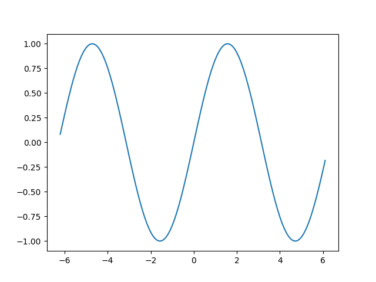

# 빌더 패턴 (Builder Pattern)

*[Gang of Four](../../gang-of-four/index.qmd)의 "생성 패턴"*

<div class="admonition">

**결론**

Gang of Four가 구상한 전통적인 빌더 패턴은 복잡한 객체 생성 과정을 추상화하여 다양한 결과물을 만들어내는 것이 목적이었으나, 파이썬에서는 이러한 형태의 사용이 드뭅니다. 대신 파이썬에서 빌더는 주로 호출자의 편의를 위해 복잡한 내부 객체 구조를 숨기는 용도로 널리 사용됩니다.

또한, 불변 객체를 생성하기 위해 별도의 빌더 클래스를 두는 현대적인 방식도 파이썬에서는 거의 필요하지 않습니다. 언어 차원에서 제공하는 선택적 키워드 인자(Keyword Arguments) 기능이 그 역할을 완벽히 대신하기 때문입니다.

</div>

<div class="contents" backlinks="none">

목차:

</div>

빌더 패턴은 흥미로운 역사를 가지고 있습니다. Gang of Four가 책에서 설명한 원래 의도와는 달리, 오늘날에는 주로 호출자의 편의를 위한 도구로 사용됩니다.

최근에는 생성자 인자가 많은 언어에서 가독성을 높이기 위해 "빌더"라는 이름을 빌린 단순한 패턴이 유행하기도 했습니다. 이 글에서는 파이썬에서 빌더 패턴이 어떻게 활용되는지, 그리고 왜 전통적인 방식이 파이썬에서는 드문지 살펴보겠습니다.

## 편의를 위한 빌더

파이썬에서 빌더 패턴은 매우 인기가 높습니다. 복잡한 객체 계층을 생성하면서도 사용자 코드는 단순하고 세련되게 유지할 수 있기 때문입니다.

라이브러리가 일련의 간단한 메서드 호출만으로 내부의 복잡한 객체 망을 알아서 구성해준다면, 이를 빌더 패턴이 적용된 것이라고 볼 수 있습니다. 호출자는 각 객체를 직접 생성하거나 서로 어떻게 연결되는지 알 필요가 없습니다.

가장 대표적인 예는 [matplotlib](https://matplotlib.org/) 라이브러리의 `pyplot` 인터페이스입니다. 단 한 줄의 코드로 그래프를 그리고 저장할 수 있습니다.

```python
import numpy as np
import matplotlib.pyplot as plt

x = np.arange(-6.2, 6.2, 0.1)
plt.plot(x, np.sin(x))
plt.savefig('sine.png')
```



이 짧은 코드 뒤에서 `matplotlib`은 12개 이상의 객체를 생성합니다. 예를 들어, `plot()` 호출 한 번으로 생성된 객체 중 일부를 확인해 보면 다음과 같습니다.

```python
>>> plt.gcf()
<Figure size 640x480 with 1 Axes>

>>> plt.gcf().subplots()
<matplotlib.axes._subplots.AxesSubplot object at 0x7ff910917a20>

>>> plt.gcf().subplots().bbox
TransformedBbox(
    Bbox(x0=0.125, y0=0.10999999999999999, x1=0.9, y1=0.88),
    BboxTransformTo(
        TransformedBbox(
            Bbox(x0=0.0, y0=0.0, x1=6.4, y1=4.8),
            Affine2D([[100. 0. 0.] [ 0. 100. 0.] [ 0. 0. 1.]]))))
```

`pyplot`은 이처럼 복잡한 세부 사항을 호출자에게 숨겨줍니다. 사용자는 필요할 때만 추가 인자를 통해 그래프를 세밀하게 조정하면 됩니다.

반면, 빌더 패턴을 사용하지 않아 사용자에게 모든 객체 생성을 떠넘기는 라이브러리도 있습니다. [Requests](http://docs.python-requests.org/en/master/) 라이브러리는 자사 라이브러리의 간결함을 강조하기 위해 과거 표준 라이브러리인 `urllib2`의 복잡한 사용 방식을 자주 인용합니다. `urllib2`로 인증이 필요한 요청을 보내려면 다음과 같이 여러 객체를 직접 조립해야 합니다.

```python
import urllib2

# HTTP 인증을 위한 복잡한 객체 조립 과정
auth_handler = urllib2.HTTPBasicAuthHandler()
auth_handler.add_password(realm='PDQ Application', 
                          uri='https://mahler:8092/site-updates.py', 
                          user='klem', passwd='password')
opener = urllib2.build_opener(auth_handler)

# 전역 설정 후 요청 실행
urllib2.install_opener(opener)
urllib2.urlopen('http://www.example.com/login.html')
```

만약 여기에 빌더 패턴이 적용되었다면, 라이브러리 차원에서 이 모든 과정을 숨기는 간결한 인터페이스를 제공했을 것입니다.

## 디자인의 미묘한 차이

`pyplot`이 진정한 의미의 빌더인가에 대해서는 이견이 있을 수 있습니다. Gang of Four는 다음과 같이 명시했습니다.

> "빌더는 **최종 단계에서 제품을 반환하지만**, 추상 팩토리는 제품을 즉시 반환한다."

즉, 빌더는 모든 구성이 끝난 뒤 완성된 객체를 반환해야 합니다. 만약 객체를 반환하는 최종 단계가 없다면, 이는 빌더보다는 **퍼사드(Facade)** 패턴에 가까울 수 있습니다. 엄격한 정의를 따르자면 `plt.plot()`은 객체를 명시적으로 요청하지 않으므로 빌더가 아닐 수 있습니다. 하지만 다음과 같이 호출하면 빌더의 조건을 충족하게 됩니다.

```python
plt.plot(x, np.sin(x))
fig = plt.gcf()  # "get current figure" - 완성된 객체를 가져옴
fig.savefig('sine.png')
```

## 전통적인 빌더 패턴과 데이터 구조

Gang of Four가 구상한 빌더 패턴의 원래 목적은 훨씬 더 원대했습니다.

> "복잡한 객체의 생성 과정을 그 표현 방식과 분리하여, 동일한 생성 과정에서 서로 다른 표현을 만들 수 있게 한다."

즉, 동일한 명령(예: "문 가져오기", "방 만들기")을 내리더라도 어떤 빌더를 사용하느냐에 따라 "미로"가 만들어질 수도 있고, "설계도"가 만들어질 수도 있어야 한다는 것입니다.

하지만 현대 파이썬 라이브러리에서 이런 방식의 설계는 흔치 않습니다. 왜일까요? 파이썬은 풍부한 데이터 구조(튜플, 리스트, 딕셔너리)를 제공하므로, 굳이 복잡한 빌더 인터페이스를 여러 개 구현하는 대신 **단일한 중간 데이터 표현**을 생성하는 방식을 선호하기 때문입니다. 일단 데이터 구조가 만들어지면, 이를 순회하면서 필요한 형태(그래프, 파일, UI 등)로 변환하는 것이 훨씬 직관적이고 다루기 쉽습니다.

## 퇴화된 빌더: 선택적 인자 시뮬레이션

마지막으로, 다른 언어에서 흔히 볼 수 있는 "퇴화된 빌더(Degenerate Builder)" 패턴을 살펴보겠습니다. 이는 파이썬처럼 강력한 선택적 매개변수 기능이 없는 언어에서 가독성 문제를 해결하기 위해 사용됩니다.

이 패턴은 다음과 같은 상황에서 쓰입니다.
- 불변(Immutable) 객체를 설계했으며, 생성 시점에 모든 속성(예: 12개)을 지정해야 함.
- 언어가 키워드 인자를 지원하지 않아, 인자 순서만으로 어떤 값인지 구분해야 함. (예: `None, None, 0, '', None...`)

이런 고충을 해결하기 위해 개발자들은 가변(Mutable) 객체인 "빌더 클래스"를 별도로 만듭니다. 빌더에서 각 속성을 하나씩 설정한 뒤, 최종적으로 `build()` 메서드를 호출해 실제 불변 객체를 생성하는 방식입니다.

```python
# 파이썬의 방식: 키워드 인자로 깔끔하게 해결
class Port(NamedTuple):
    number: int
    name: str = ''
    protocol: str = ''

p = Port(517, protocol='UDP')

# 인자가 부족한 언어에서의 빌더 방식 시뮬레이션
class PortBuilder:
    def __init__(self, port):
        self.port = port
        self.name = None
        self.protocol = None

    def build(self):
        return Port(self.port, self.name, self.protocol)

b = PortBuilder(517)
b.protocol = 'UDP'
p = b.build()
```

파이썬 개발자라면 굳이 이런 복잡한 빌더 클래스를 만들 이유가 없습니다. 파이썬의 함수 호출 방식은 이미 충분히 유연하고 명확하기 때문입니다. 다른 언어에서 넘어온 코드를 분석할 때 이런 패턴을 마주친다면, 파이썬답게 더 단순한 방식으로 리팩토링할 수 있음을 기억하세요.
